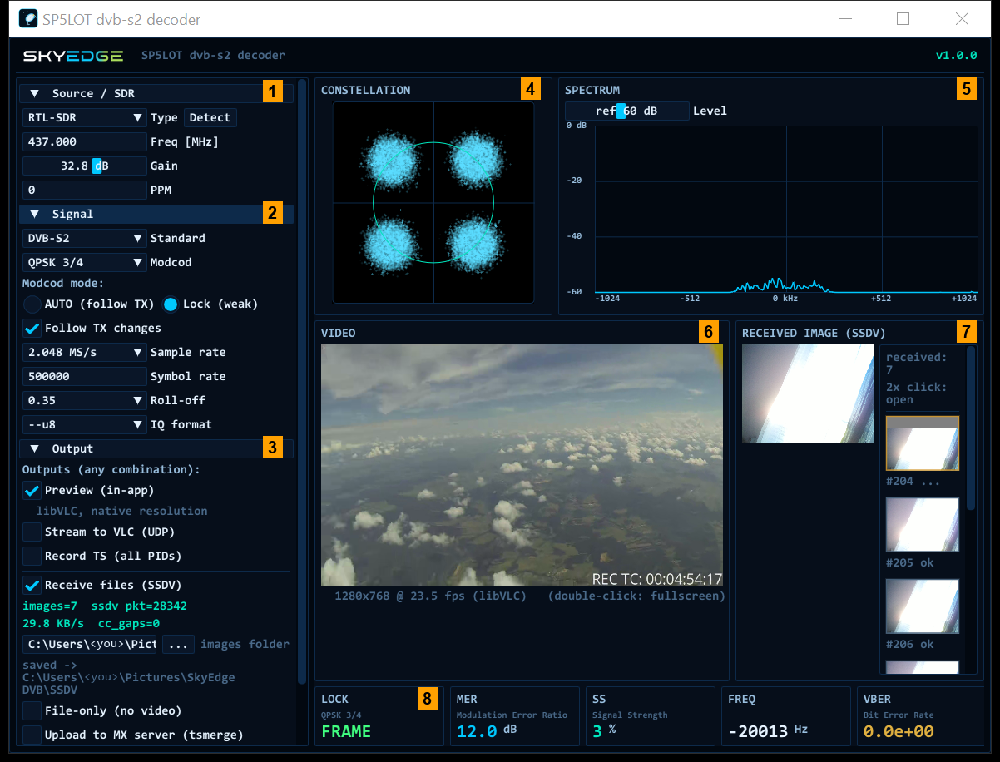
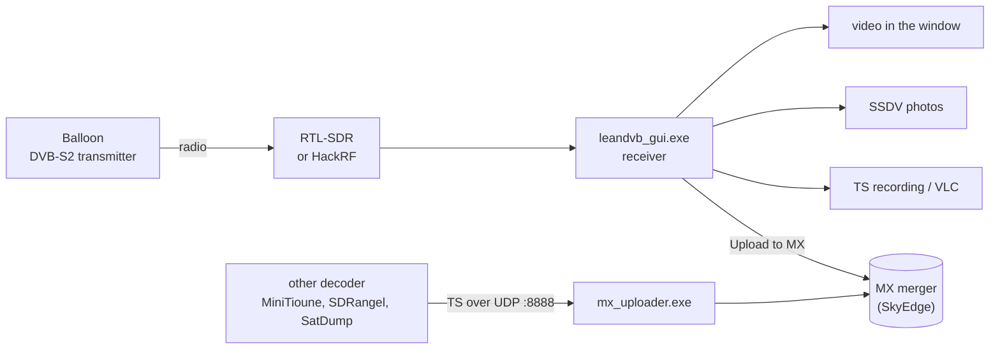
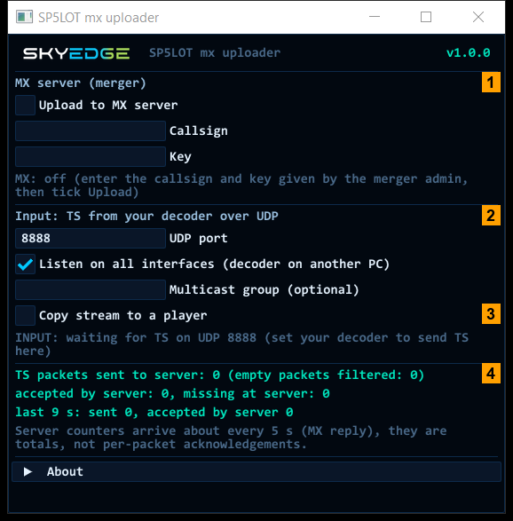

# SP5LOT DVB-S2 decoder (SkyEdge)

A Windows receiver for **DVB-S2 video from high-altitude balloons**. It shows the live video,
saves the **SSDV photos** sent by the balloon and can forward the stream to the **SkyEdge MX merger**,
which combines the reception of many ground stations. It works with an **RTL-SDR** dongle or a **HackRF One**.

The download also contains **[MX Uploader](#mx-uploader)**: it sends the stream of *other* DVB-S2 decoders
(MiniTioune, SDRangel, SatDump and others) to the same MX merger. It is also available as its own small ZIP.

Inside the receiver, the DVB-S2 demodulator is **leandvb** from [leansdr](https://github.com/pabr/leansdr) by pabr,
and the LDPC decoder is `ldpc_tool` by Ahmet Inan (adapted by pabr), both with our patches. This project adds the Windows receiver
window, SDR control, SSDV photos and the MX upload. It is an unofficial program, not affiliated with the leansdr
author: please report problems here, not upstream.

## Download

Get the ZIP from **[Releases](../../releases/latest)**. There is no installer: everything is in one folder.

| File in the release | For whom |
|---|---|
| `SP5LOT-dvbs2-decoder-<version>-win64.zip` | the receiver with RTL-SDR or HackRF, plus MX Uploader (all in one) |
| `SP5LOT-mx-uploader-<version>-win64.zip` | only MX Uploader, for stations that receive with another decoder (under 1 MB) |
| `SP5LOT-dvbs2-decoder-<version>-source.zip` | source code, for developers |

**You need**

- Windows 10, 64-bit (tested on three PCs). Windows 11 should work but has not been tested.
- An RTL-SDR dongle or a HackRF One with the **WinUSB** driver. Install it once with
  [Zadig](https://zadig.akeo.ie): pick the device, choose *WinUSB*, click *Install Driver*.
- Optional: [VLC media player](https://www.videolan.org/vlc/) 64-bit in its default folder.
  The video preview uses it; without VLC the preview uses ffmpeg instead.

**Install**

1. Extract **all** files from the ZIP into one folder where you can write, for example on the Desktop.
   Not into `C:\Program Files`: the programs save their settings next to the exe.
2. Run `leandvb_gui.exe` (the receiver) or `mx_uploader.exe` (the uploader).
3. The programs are not signed, so Windows may show *"Windows protected your PC"*:
   click *More info*, then *Run anyway*.
4. On a slow PC the very first start can take up to half a minute (VLC builds its plugin list). Later starts are fast.

## How it fits together

## The receiver window

| | What it is | What to do |
|---|---|---|
| **1** | **Source / SDR** | Choose RTL-SDR or HackRF, type the frequency in MHz (default 437.000), set the gain. |
| **2** | **Signal** | DVB-S2, the MODCOD of the transmitter (default QPSK 3/4), symbol rate (default 500000). *Lock (weak)* with *Follow TX changes* is the default, see below. |
| **3** | **Output** | What to do with the stream, in any combination: preview, VLC, TS recording, SSDV photos, upload to MX. |
| **4** | **Constellation** | Four clean dots = a good QPSK signal. A round cloud = too weak. |
| **5** | **Spectrum** | The transmitter is the hump in the middle. *Level* moves the scale. |
| **6** | **Video** | Live video. Double-click for full screen. |
| **7** | **Received image (SSDV)** | The photo being received now and the list of photos received since the start. Double-click a thumbnail to open it. |
| **8** | **Status** | **LOCK**: *FRAME* (green) means data is decoded, *CARRIER* means the signal is found but not decoded yet. **MER**: signal quality in dB, more is better (for QPSK 3/4 the DVB-S2 standard gives about 4 dB). **SS**: signal strength. **FREQ**: carrier offset. **VBER**: bit errors, 0 is clean. |

**Modcod mode.** A balloon transmits one MODCOD for the whole flight, so the receiver decodes only the
selected one (*Lock*). If the transmitter uses another MODCOD, *Follow TX changes* switches the receiver
to it by itself within a few seconds (short restart), and the choice is remembered. *AUTO* accepts every
MODCOD at once, for transmitters that change it often.

## Quick start

1. Plug in the SDR and start `leandvb_gui.exe`.
2. **1**: choose the SDR and type the frequency of the balloon.
3. **2**: check the symbol rate (ask the balloon team, for example 500000 or 250000).
4. Press **START**. After a few seconds LOCK shows *FRAME*, the video appears and photos start to arrive.

## Outputs

- **Preview (in-app)**: video in the window.
- **Stream to VLC (UDP)**: the full transport stream to an address and port, default `127.0.0.1:1234`.
  In VLC: *Media > Open Network Stream* > `udp://@:1234`. It can also go to another PC.
- **Record TS (all PIDs)**: a new file `rec_<date>.ts` at every start, never overwritten. Folder: *Videos\SkyEdge DVB*.
- **Receive files (SSDV)**: photos from the balloon, saved as `rx_NNNN.jpg`. Folder: *Pictures\SkyEdge DVB\SSDV*.
  The *...* button chooses another folder.
- **Upload to MX server (tsmerge)**: tick it and enter your station **callsign** and **key**. Both are empty after
  installation; the operator of the MX merger gives them to you. The status line shows when the server has accepted your station.

## MX Uploader

For stations that already receive with another DVB-S2 decoder (MiniTioune, SDRangel, SatDump or any decoder
that can send the transport stream over UDP): MX Uploader takes that stream and sends it to the SkyEdge MX merger.
One small program, no installation: `mx_uploader.exe` is in the main ZIP and in its own small ZIP.

| | What it is | What to do |
|---|---|---|
| **1** | **MX server (merger)** | Enter the callsign and key given by the merger admin and tick *Upload to MX server*. The line below shows the state: *ONLINE, station accepted* means it works. |
| **2** | **Input** | In your decoder, send the TS over UDP to this port (default `8888`, so `127.0.0.1:8888` on the same computer). *Listen on all interfaces* (ticked by default) lets a decoder on another computer send here; Windows may ask about the firewall on the first start. Multicast group is optional. |
| **3** | **Copy stream to a player** | Sends the same stream to `127.0.0.1:1235`, for example to VLC (`udp://@:1235`). |
| **4** | **Counters** | Packets sent to the server, accepted by the server and missing at the server. The server reports its counters about every 5 s. |

Several receivers at once: one copy per receiver, each with its own settings file and input port, for example
`mx_uploader.exe --config station2.ini`.

## Settings and logs

- Settings are saved next to the exe: `leandvb_gui_settings.ini` and `mx_uploader.ini`. They keep the folders,
  outputs, MX callsign and key, SDR and gain, and the MODCOD. **They contain your key: do not share them.**
- Diagnostic logs: `%TEMP%\leandvb_gui\gui_log.txt` and the folder `%TEMP%\mx_uploader\`.
  The logs contain your callsign and folder names, never your key.
- All files from the ZIP must stay in the same folder. When you update to a new version, copy
  `leandvb_gui_settings.ini` (and `mx_uploader.ini`) into the new folder to keep your settings.

## Known limitations in 1.0.0

- Frequency and symbol rate are not remembered: every start begins with 437.000 MHz and 500000 symbols/s.
- The bundled RTL-SDR library has no support for the **RTL-SDR Blog V4** (not tested with a V4).
- HackRF: in rare cases the USB stream stops; restart the program.
- Folder names with characters outside the Windows system code page may not work.

## Problems and ideas

Please use **[Issues](../../issues/new/choose)**: there are short forms for a bug report and for an idea.
For a bug, the version (top right of the window) and the end of `gui_log.txt` help most.

## For developers

- **Source code:** every release has a second file, `SP5LOT-dvbs2-decoder-<version>-source.zip`, with the full
  source of both programs, our patches to the engine and `BUILDING.md` (how to build it with MSYS2).
- The DVB-S2 engine is [leansdr](https://github.com/pabr/leansdr) by pabr (www.pabr.org) with our patches.
- SSDV photos travel inside the same DVB-S2 transport stream as SSDV packets on **PID 0x00C8** (SkyEdge format).
- The address of the SkyEdge MX merger is not in the source code; a build from source can use your own merger (see `BUILDING.md`).

## License

GNU General Public License v3.0 ([LICENSE](LICENSE)). Third-party components and their licenses:
[THIRD_PARTY.md](THIRD_PARTY.md).
